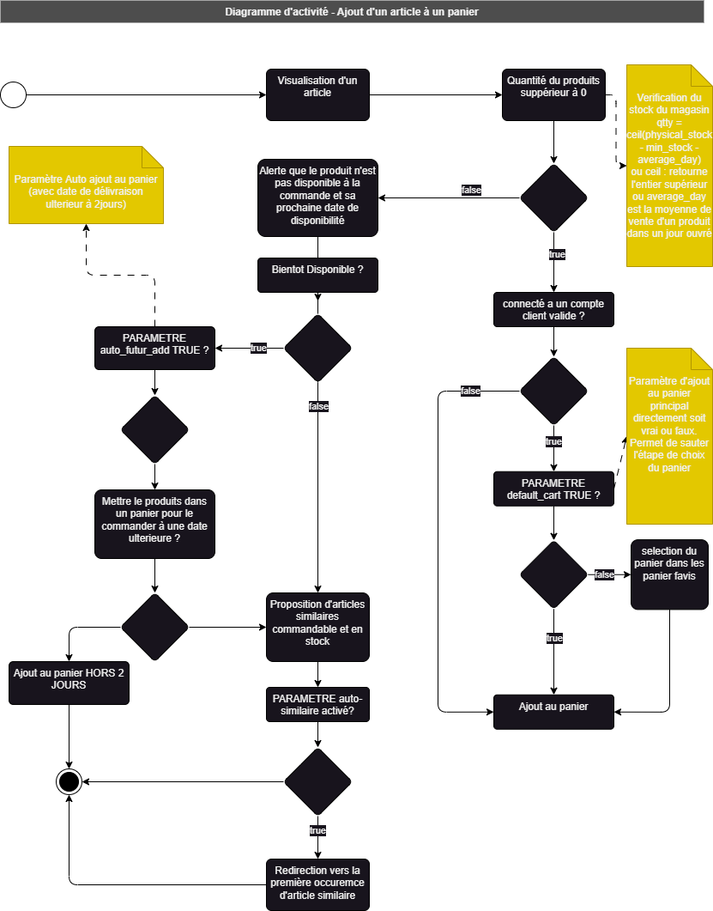
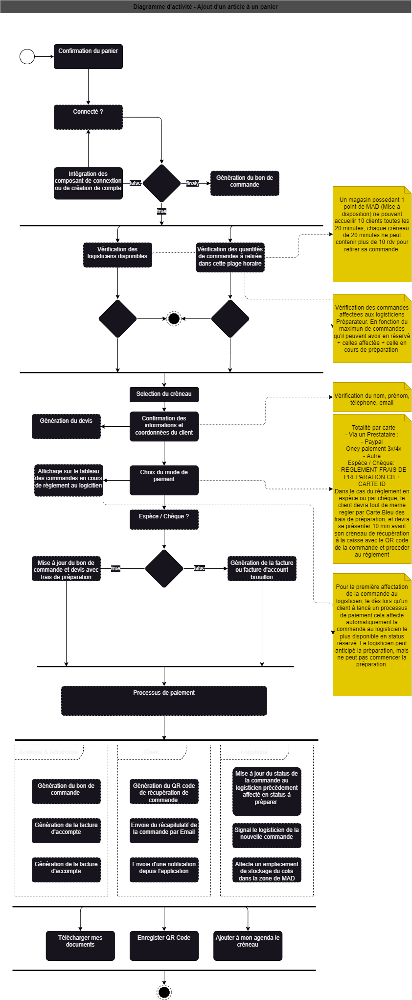

# Rendu - Projet de Click And Collect pour l'enseigne Les Mousequetons

# Sommaire 

## [La "demande du client"](#client_request)
## [Récapitulatif](#summary)
## [Diagrame d'activité 1 - Commande client](#)

## <a id="client_request"> La "demande du client"

L'enseigne de supermarché Les Mousquetons souhaite mettre un drive click and collect, dans leur réseau.

Ils disposent d'une couverture nationale avec un magasin dans chaque préfecture et sous-préfecture.

Chaque magasin sera équipé d'une zone de retrait pouvant accueillir 10 clients toutes les 20 minutes sur une tranche horaire de 10h à 18h.

Toute commande devra être demandé au plus tard 2 jours avant la date et l'horaire de retrait.

La cible visée est la clientèle de notre enseigne.

Remarque :

Le stock du magasin sera aussi le stock du drive.

*Tous les autres spécifications de la demande client sont disponible dans le fichier [drive.md](./drive.md)*

## <a id="summary"> Récapitulatif

- Cas d'utilisation client
     - Mettre ses article dans un panier
     - Sauvegarder son panier
     - Completer, dupliquer un panier sauvegarder
     - Passer commande d'un panier 
     - Payer sa commande en ligne ou à la caisse
     - Récupérer les informations de sa commande

- Cas d'utilisation caisse (si paiement espèce ou chèque)
     - Lecture d'un QR Code ou code barre sur le téléphone du client
     - Faire payer le client 
     - Confirmer le status de la commande au client

- Cas d'utilisation logisticien - Préparateur
     - Récupérer une commande à préparer
     - Valider la récupération d'un article
     - Validation de son panier de récupération
     - Emballage de son panier
     - Validation d'emballage
     - Récupération des information de stock du colis
     - Validation de préparation de la commande

- Cas d'utilisation logisticien - Délivreur
     - Récupérer une commande par le QR Code ou coordonnée du client.
     - Vérifié son status de paiement
     - Valider la récupération de la commande

## <a id="da1_customer_order"> Diagrame d'activité 1 - Commande client

### Ajout au panier

### Passage de commande d'un panier

## <a id="da2_order_preparing"> Diagramme d'activité 2 - Préparation de la commande

asdas
## <a id="class_diagram"> Diagramme de classe 

asdasd
### <a id="data_classification"> Data classification

Petit récapitulatif des différentes grandes parties de données.

#### Données concernant le groupe Les Mouquetons
- **_group** : Information sur la sociétée mère
- **_group_secret**: Table rendant le token principale de décryptage, sera mise à jour toute les heures 

#### Données concernant le magasin :
- **_shop** : Données du magasin. Chaque Magasin devra avoir un identifiant unique. 

- **_product** : Données produits (fournie par la DSI)

- **_stock** : Définitions des prix et quantités en stock

- **_warehouse**: Définitions des entrepôts et locals de rangements contient un paramètre de nature du produit

#### Définitions des données utilisateurs, répartie par type pour renforcer la difficulté d'accès aux données d'autre type d'utilisateurs avec une authentification forte.

##### Visiteur (guest)
- **_user_guest** : Données des utilisateurs générer par les visiteurs ne possédant pas encore de compte.
- **_user_guest_tmp_cart**: Donnée du panier temporaire pour les utilisateurs non connectés
- **_user_guest_tmp_info**: Coordonnées et adresse clients 
- **_user_guest_tmp_order**: Commandes des utilisateurs non enregistré à part de la table des commande principale pour limité leur accès au données sans possibilité légale de retracer leur provenance.

##### Client Authentifié (customer)
- **_user_customer** : Tables des données utilisateurs. (id, email, clef_publique_cryptée(mise à jour toutes les heures), date de création du compte)
- **_user_customer_secrets**: Table protégér par un jwt token comportant les données sensibles du clients. (mot de passe, clefs privé) 
- **_user_customer_info**: Informations(Prénom, Nom, Date de naissance), coordonnées(Téléphone, Email) et adresses du clients(Spé Numero rue, Numéro de la rue, Nom de la rue, Région, Pays)
##### Utilisateurs Logisticien (logisticiens)
- **_user_logistician** : Peut avoir deux fonction, Préparateur ou Délivreur. 

##### Terminal de paiement en caisse
- **_user_checkout**: Simplement les identifiants de connexion au terminal caisse pour le règlement des commandes en espèce ou chèque (id, name, )
- **_user_checkout_secret**: 

##### Utilisateurs exterieurs (DSI)
- **_user_dsi** : Tables des données d'accès à l'ensembles des fonctionnalités disponible via Web Services.
- **_user_dsi_secret**: Données d'identification (id, Token, identifiants unique, empreinte etc..)

#### Autre donnée:

- **_adress** : Table de regroupement des adresses
- **_taxe_rules** : Définition des différentes taxes
- **_payment_provider**: Définitions des différents information de connexion au fournisseurs de méthode de payment (ID, nom du fournisseur, Identifiant externe, Mots de passe, Token, autre...)
- **_cookie_** : Définitions des authorisation des cookies par utilisateurs
- **_cookie_product**: Données récupérée par les cookies concernant les produits, leurs demandes, statistiques, moyennes etc..
- **_cookie_user**: Données récupéer par les cookies concernant les utilisateurs de la plateforme.

## Conclusion

Ce projet reste un énorme défi logistique, une étude approfondie est indispensable à la bonne réalisation des différents processus.
